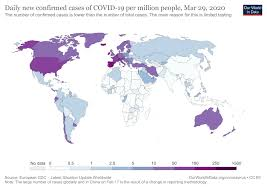

# COVID-19 Data Cleansing
<p align="center">
  
</p>

## Table of Contents
* [General Information](#general-information)
    * [Data](#data)
* [Technologies](#technologies)
    * [Python](#python)
    * [Database](#database)
* [Future Improvements](#future-improvements)

## General Information
COVID-19 has taken center stage in our lives recently.  A lot of people are working tirelessly around the clock to mitigate this issue, and to all I am immensely grateful.  I know that there are many people utilizing their own particular skill set to bring about some insight to this disease.  I wanted to contribute my small gain of sand. I merged all csv files from the github repo setup by Johns Hopkins and returned one uniformed ‘clean’ dataset.  I will make daily updates to the file.  All code on how I merged the data can be found under my ```notebooks``` folder.  Cleaned ```csv``` file can be found under ```data``` folder. 

## Technologies
<p align="center">
  
</p>

###### Python:
Data Analysis: Python 3, Numpy, Pandas<br>

###### Database:
Databases: MongoDB 

## Future Improvements
One of the key concepts I learned from data science is that at times you have to establish a base (working) model.  You can got back and optimize.  I will be updating some of the code to work more efficiently at a later date.  However, the csv file will remained updated with the same output format daily.  